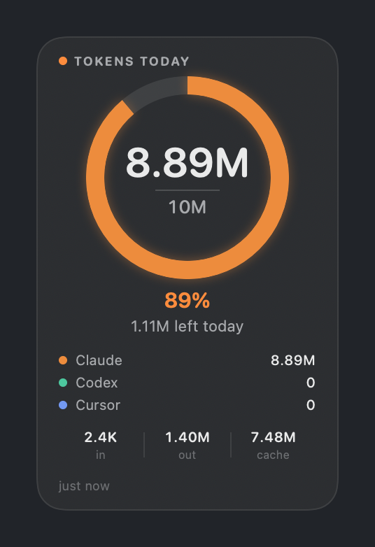
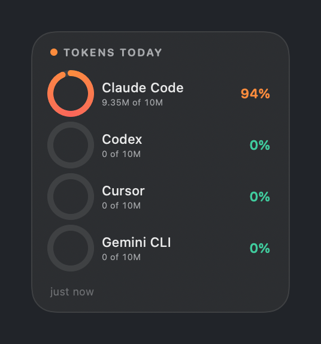
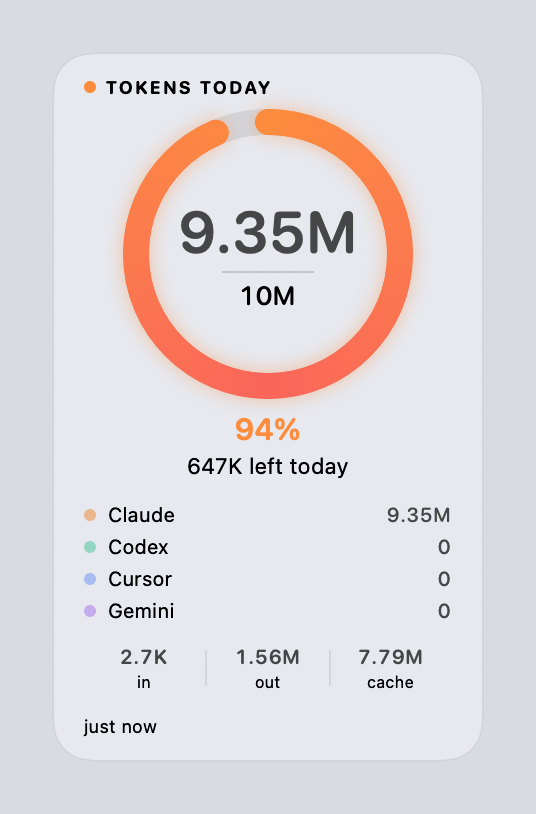
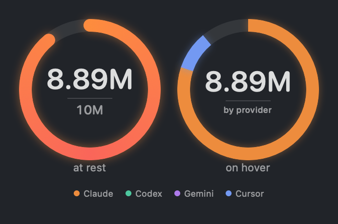
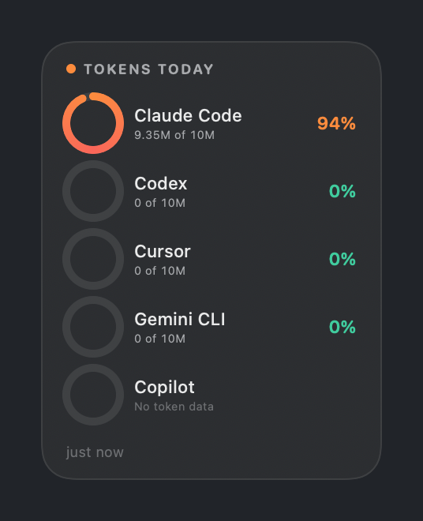

# Token Counter

**A macOS desktop widget that shows how many tokens you've spent today across Claude Code, Codex, Gemini CLI, and Cursor, drawn as a ring against a daily target you set.**

It isn't a billing tool, and it never contacts a provider's API. Every figure comes from files those tools have already written to your disk.


  

Both shots are real output. The providers reading 0 hadn't run that day, which is what an unused provider looks like.

The panel is borderless and draggable, sits above your windows or behind them, and reads the figures again every 5 minutes. A menu bar item carries the same percentage. The count resets at local midnight.

## What each provider actually gives you

The five tools don't record the same thing, and three of them needed a rule of their own. The panel shows how much each figure is worth rather than averaging over the difference.

| Provider | Read from | What you get |
|---|---|---|
| Claude Code | `~/.claude/projects/**/*.jsonl` | Exact. Per call, timestamped, with cache writes and cache reads split out |
| Codex | `~/.codex/sessions/**/rollout-*.jsonl` | Exact. Per turn, timestamped, with cached input but no cache writes |
| Gemini CLI | `~/.gemini/tmp/*/chats/session-*.json` | Exact. Per message, timestamped, with cached input but no cache writes |
| Cursor | Cursor's `state.vscdb` | A floor, marked `≥`. Only some requests carry a count, and they're dated by conversation |
| Copilot | Copilot's session store | Nothing. No token column exists, so no figure is shown and it stays out of every total |

Copilot is off by default, since it can never show a number. Turn it on if you'd rather see it listed saying so.

## Why this exists

I keep three coding agents in rotation and had no idea what any of them had cost me by lunchtime. The numbers were already sitting on my disk, because each tool writes its own transcripts, but nothing put them in one place where I'd see them without going to look.

What tipped me into building it was measuring one day two ways and getting two answers that were 54 times apart. On 7 Sep 2026 my Claude Code transcripts reported 8.22 million tokens by one reading and 440.86 million by another, from exactly the same files. Whichever of those you pick decides what a daily target means, so the counter has to take a position rather than show you "tokens".

## Cache reads are excluded, because counting them measures the cache instead of the work

The obvious approach is to add up every figure a transcript reports:

```
used = input + output + cache_writes + cache_reads
```

That's what produced 440.86M on the day above. Almost all of it is `cache_reads`: 432.63M of the 440.86M, because every turn in a long conversation re-reads the whole prompt prefix out of the cache. The figure tracks how long your conversations are, and a target set against it tells you nothing about how much work you asked for.

So the default drops that term:

```
used = input + output + cache_writes        # 8.22M on the same day
```

On this machine a heavy day lands between 6M and 9M under that formula, which is what makes a target like 10M/day mean something. Turn **Count cache reads** on in settings if you want the gross figure, and move the target to roughly 500M to match.

Cache reads are still collected and still shown in the breakdown row. They're excluded from the total, not discarded.

One asymmetry to know about: the breakdown's cache column is cache writes, and only Claude Code reports those. Codex and Gemini report a cached-input figure, which lands in cache reads, and neither reports cache writes at all. So that column reads 0 unless Claude Code is one of the enabled providers.

## The dial's colour is the reading, and the split is one hover away

A ring can encode either how close you are to your target or where the tokens went, and trying to do both at once does neither well. Colouring each provider its own shade tells you the composition but throws away the thing you actually glance at the panel for, which is whether you're fine, close, or over.

So the resting dial is a single arc coloured by progress: green under 60%, amber from 60%, orange from 85%, and red once you pass the target. Hovering the ring splits that same arc by provider, keeping the extent identical and changing only how it's divided.



The split above is real, and it's lopsided because my usage is. Each small dial in per provider mode is coloured by progress for the same reason, with provider colours kept for the legend and the hover split.

Every colour is defined once, in `Palette.swift`, with a light and a dark value: the hues stay luminous on a dark ground and sit a step deeper on a light one. Red is reserved for over-target and isn't used for anything else.

The provider hues follow Okabe-Ito, and they're chosen with a validator rather than by eye. That matters more than it sounds: the first version had Cursor in blue and Gemini in violet, which measure 2.1 ΔE apart under deuteranopia. To a red-green colourblind reader they were the same colour, sitting next to each other in the legend. Blue and violet can't be pulled apart by hue, so Gemini moved to a plum with a real lightness gap from both the blue and the green. The four now clear ΔE 8.9 in light and 10.4 in dark under deuteranopia, and every colour measures at least 3:1 against its own background.

## A day's total is written continuously, not at midnight

The obvious way to keep a daily history is to write the day's figure when the day ends. That loses a day whenever the Mac is asleep or shut down at midnight, which for a laptop is most nights.

So today's row is rewritten on every scan instead. The write is an upsert keyed by the day, which makes it idempotent: scanning twice in a minute leaves one row, and when the clock passes midnight yesterday's row is already complete and today's simply starts. Nothing has to happen at midnight for the history to be right.

Two things the chart draws that a simpler store would flatten:

- **A day the app never ran is not a quiet day.** An idle day records zero; a day with the app shut records nothing. The first is a bar of height zero, the second is a shaded column, and the summary line counts them separately.
- **A provider that reports no token counts is never stored as zero.** Copilot is left out of the row entirely rather than written as a zero it did not earn.

History lives in `~/Library/Application Support/TokenCounter/history.json`, holds up to 400 days, and is a few hundred bytes per day. Days before you first ran the app are not in it, and cannot be: the providers only ever count the current day, so there is nothing to backfill from without re-reading every transcript.

## The hard cases

### Codex counts upward, and says everything twice

Codex logs a `token_count` event holding two figures: `total_token_usage`, cumulative for the session, and `last_token_usage`, the most recent turn. It emits the pair twice per turn. Four consecutive events from one real session:

```
09:34:46   total in=9603    | last in=9603
09:34:47   total in=9603    | last in=9603
09:34:53   total in=25251   | last in=15648
09:34:53   total in=25251   | last in=15648
```

Summing `last_token_usage` gives 50,502 input tokens where the session had used 25,251, so it double counts. Reading the final `total_token_usage` instead can't attribute a session to a day, and a session that runs past midnight belongs to both.

The rule is to bank each rise in the cumulative figure, and date each rise by the event that carried it:

```
delta = total_now - total_last_seen_for_this_session
if delta > 0 and event_timestamp >= local_midnight:
    add delta
```

Deltas are tracked whether or not they land today, so the baseline stays correct. That's what stops a session started yesterday from dumping its whole history into this morning on the first scan.

### Claude Code logs the same call several times

A resumed session and a sub-agent sidechain both re-log turns that already happened, so records repeat across transcripts. Today's files held 2,435 usage records for 1,219 actual calls, and one call appeared 4 times. Counting records rather than calls would have roughly doubled the total.

Each record is deduped on `message.id` plus `requestId`. The dedupe set is kept for the current day only and thrown away at midnight, since older records are never counted again anyway.

### Gemini rewrites its session files in place

Claude Code and Codex append to JSONL transcripts, which is what makes a byte cursor work. Gemini CLI writes a whole JSON document per session and rewrites it as the session grows, so there's no append point to remember. Instead each file is skipped while its modification date is unchanged, and messages are deduped by id, so re-reading a file that grew counts only what's new.

Gemini's arithmetic also needs unpacking. A message reports six figures, and `total` is `input + output + thoughts + tool` while `cached` is the cached slice of `input`, not another addend:

```
{"input": 52945, "cached": 52735, "output": 761, "thoughts": 1862, "tool": 0, "total": 55568}
```

Mapping keeps that sum intact. The cached slice becomes a cache read, thinking tokens join output, and tool tokens join input because they arrive as prompt context:

```
input      = input - cached + tool
output     = output + thoughts
cache_read = cached
```

Summed across every session on this machine that mapping gives 159,515 tokens, which is exactly the sum of Gemini's own `total` fields. That equality is the check that the mapping loses nothing.

### Copilot records no tokens at all

Copilot is in the list because it's worth knowing that it can't answer the question. Three stores were checked:

- `~/.copilot/logs` holds process startup lines and nothing else.
- Copilot's session store, `session-store.db` in the `github.copilot-chat` extension storage, has no token column in any table. Its `turns` table keeps the user message, the assistant response, and a timestamp. Every table was empty here.
- VS Code's own `chatSessions` documents carry no usage figures.

So Copilot reports "no token data" rather than a number, and it's excluded from every total. That distinction matters: a provider that reports 0 has been idle, and a provider that reports nothing can't tell you either way. Showing 0 for the second case would be a claim the data doesn't support.



### Cursor barely records anything

Cursor is the weakest of the three sources, and the panel says so rather than papering over it:

- Only some messages carry a non-zero `tokenCount`. In my database, 119 of 10,068 did.
- A message has no timestamp of its own. The only date available belongs to the conversation, so a conversation opened yesterday and continued today counts against yesterday.
- Cursor reports input and output only, with no cache figures.

A Cursor figure is therefore a floor, not a total. The panel prefixes it with `≥` and settings labels the provider "partial data". The Cursor CLI keeps separate transcripts under `~/.cursor/chats`, but those record no token counts at all, so there's nothing to read there.

### Reading 150MB every 5 minutes

A full pass over my Claude Code transcripts reads about 150MB of the day's files. Doing that every 5 minutes is wasteful, so each file gets a byte cursor and a refresh parses only what was appended since the last one. A cold first scan takes a few seconds; warm refreshes take about 0.1 seconds.

Two details make that safe. A read stops at the last newline in the file, so a half written trailing line is picked up next time instead of being parsed as truncated JSON. And on first sight of a file whose modification time predates today, the cursor jumps straight to the end, because a file nobody touched today can't hold today's records.

## Privacy, and what it costs

Every claim below is one you can check without taking my word for it.

**It makes no network calls.** `grep -rE "URLSession|import Network" Sources/` returns nothing, `Package.swift` declares no dependencies, and `otool -L` on the built binary lists no networking framework. The caveat in the same breath: the app isn't sandboxed and is signed ad-hoc, so macOS isn't enforcing any of this. You're trusting a binary you built from this source a minute ago. The cost is that you have to build it yourself, and what makes that tolerable is that there are 1,715 lines of Swift here and nothing pulled in from anywhere else.

**It reads token counts and timestamps, never the text of your conversations.** The complete set of fields the code reads is `input_tokens`, `output_tokens`, `cache_creation_input_tokens`, `cache_read_input_tokens`, `total_token_usage`, `tokens` (Gemini's `input`, `output`, `cached`, `thoughts`, and `tool`), `tokenCount`, `message.id`, `requestId`, `timestamp`, and `createdAt`, plus a `count(*)` over Copilot's turns. No field holding message content is read anywhere, which you can confirm by grepping `Sources/` for `"content"` or `"text"`.

**It reads these paths and no others:**

```
~/.claude/projects/**/*.jsonl
~/.codex/sessions/**/rollout-*.jsonl
~/.gemini/tmp/*/chats/session-*.json
~/Library/Application Support/Cursor/User/globalStorage/state.vscdb
~/Library/Application Support/Code/User/globalStorage/github.copilot-chat/session-store.db
~/.copilot                                    (existence check only)
```

Both databases are opened with `SQLITE_OPEN_READONLY`, since the applications that wrote them own those files.

**It is not sandboxed, and that's a real cost.** A sandboxed app can't reach `~/.claude`, so sandboxing it would mean shipping a separate helper and an App Group, which needs a paid Apple Developer team. The consequence is that nothing at the OS level stops this app reading the rest of your home directory. What mitigates it is that the three paths above are the only ones in the source, and you can check that in one grep.

**It writes state of its own**, to `~/Library/Application Support/TokenCounter/`. Those files hold today's tallies, a byte offset per transcript, and the message identifiers used for deduplication. Identifiers, not content. Delete the directory to force a full re-tally.

## Repository layout

| Path | Role |
|---|---|
| `Sources/TokenCounter/Providers/Provider.swift` | The shape every provider maps onto, and how trustworthy each one is |
| `Sources/TokenCounter/Providers/JSONLLedger.swift` | Byte cursors, midnight rollover, and state persistence |
| `Sources/TokenCounter/Providers/ClaudeProvider.swift` | Claude Code transcripts, with deduplication |
| `Sources/TokenCounter/Providers/CodexProvider.swift` | Codex rollouts, with the cumulative delta rule |
| `Sources/TokenCounter/Providers/GeminiProvider.swift` | Gemini CLI sessions, rewritten in place rather than appended |
| `Sources/TokenCounter/Providers/CursorProvider.swift` | Cursor's SQLite database |
| `Sources/TokenCounter/Providers/CopilotProvider.swift` | Copilot, which reports an absence rather than a figure |
| `Sources/TokenCounter/UsageStore.swift` | Aggregation, targets, thresholds, and the refresh timer |
| `Sources/TokenCounter/History.swift` | The daily store: upsert, retention, unobserved days |
| `Sources/TokenCounter/AnalyticsView.swift` | The daily bar chart |
| `Sources/TokenCounter/Palette.swift` | Every colour in the app, light and dark |
| `Sources/TokenCounter/RingView.swift` | The ring, either one arc coloured by progress or split by provider |
| `Sources/TokenCounter/PanelView.swift` | Panel body for both display modes |
| `Sources/TokenCounter/SettingsView.swift` | Settings |
| `Sources/TokenCounter/AppDelegate.swift` | Menu bar item, floating panel, window levels |
| `tools/icongen/` | Renders the app icon |
| `Tests/TokenCounterTests/` | Provider rules, against fixtures rather than your real transcripts |
| `tools/verify/` | Cross-checks the providers against an independent implementation |
| `tools/mutation-check.py` | Breaks each guard to prove the tests can fail |
| `tools/check.sh` | Runs every gate and fails loudly |
| `tools/make-dmg.sh` | Packages the built app for download |

## Running it

You need macOS 14 or later and a Swift 5.9 toolchain, which you get from Xcode or the Command Line Tools.

```bash
git clone git@github.com:akshaybengani/token-counter.git
cd token-counter
./build.sh
open ~/Applications/TokenCounter.app
```

`build.sh` renders the icon, compiles, assembles `TokenCounter.app`, signs it ad-hoc, and installs it to `~/Applications`. There's no Dock icon: look for the percentage in your menu bar, and drag the panel wherever you want it.

`./tools/make-dmg.sh` packages the built app as a DMG if you'd rather hand someone a download. That DMG isn't notarized, so Gatekeeper warns the first time and the user has to right-click and choose Open, or clear the quarantine flag by hand. Building from source stays the warning-free path, which is why it's the one documented first.

Nothing is deliberately absent from this repository. There are no secrets, no API keys, and no signing identity to supply, because the build signs ad-hoc with `codesign --sign -`. If you'd rather sign with your own Developer ID, change the `codesign` line in `build.sh`.

Turn on **Open at login** in settings to have it start with your Mac. That uses `SMAppService`, which can refuse for an ad-hoc signed app; if it does, settings tells you and you can add the app yourself under System Settings, General, Login Items.

## How it's tested

Three layers, because the figures fail quietly rather than loudly.

**31 unit tests** over the provider rules and the daily store, run with `swift test`. They use fixtures in the repository, never your own transcripts, so they can exercise cases your data happens not to contain: the same call logged in two transcripts, a Codex total that drops mid-session, a Gemini prompt that is entirely cache, a file ending mid-line, a record one second either side of local midnight, and a day rollover.

**A mutation check**, `python3 tools/mutation-check.py`, which breaks each of 11 guards in turn and requires a named test to go red. A suite that passes proves nothing on its own; this is what shows it can fail.

```bash
./tools/check.sh                    # build, tests, mutation check, harness
```

Or one at a time:

```bash
swift test                          # 31 tests
python3 tools/mutation-check.py     # 11 guards, each must be caught
./tools/verify/run.sh 2025-01-01    # every provider against an independent implementation
```

**A differential harness**, which scans from a cutoff you choose and compares all 5 providers field by field against `reference.py`, an independent implementation of the same rules in another language. An error has to be made identically twice, in two languages, to survive. Gemini gets a second check on top: the mapping's output has to equal the sum of Gemini's own `total` fields, which it does at 159,515.

The interface is checked by rendering `PanelView` through `ImageRenderer`, which is where the images above come from.

Gemini gets a second, stronger check: the mapping's output has to equal the sum of Gemini's own `total` fields, which it does at 159,515.

Between them these caught four real defects:

- Cursor reported 0 tokens where the reference said 8,883,586. `sqlite3_bind_text` had been called with a nil destructor, which is `SQLITE_STATIC`, so SQLite kept a pointer to a Swift string temporary that was freed before the statement ran. Every bubble lookup silently missed. It needed `SQLITE_TRANSIENT`.
- The panel never appeared, while the process ran and scanned happily. `NSHostingView.fittingSize` returns zero before its first layout pass, so the window was sized 0 by 0 and never reached the window server. Using `NSHostingController` as the panel's content view controller fixed it.
- A test that couldn't fail. The mutation check found that the Codex "total dropped" test passed with the monotonic guard removed, because the positive-delta check already absorbed a whole-figure drop. The case that needs the guard is a *partial* drop, cached input falling while the rest rises, which yields a negative cache read. The test now covers that.
- The harness itself corrupted the app's tally. Byte cursors deliberately outlive a midnight rollover, because anything past the cursor must belong to the new day. The harness wrote a cutoff day key while advancing those same cursors, so the app reset its counts, kept the cursors, and skipped a whole day's records, reporting 10 calls for a day that had had 1,252. Providers now resolve their state directory through `TOKEN_COUNTER_STATE_DIR`, which the harness points at a temporary directory.

What the harness can't tell you is whether a provider's own numbers are honest, or whether the day boundary is right for a conversation that spans midnight. For Cursor, as described above, it demonstrably isn't. There's also no automated test of the interface: the panel is checked by rendering it, and by reading it.

## Licence

MIT. See [LICENSE](LICENSE).

These are local counts read from transcript files, not an invoice. They're accurate enough to pace your own work against a target and shouldn't be relied on for billing, chargeback, or any decision about money. Cursor's figure in particular is a floor, and Copilot's is absent.
